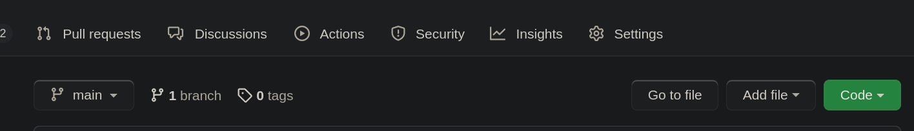
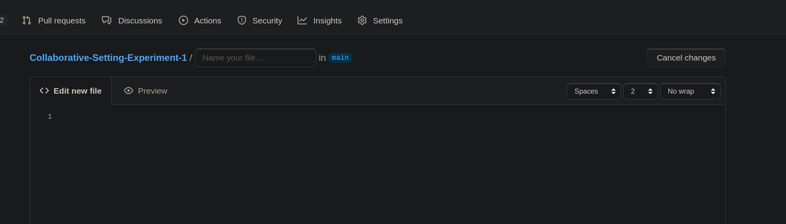
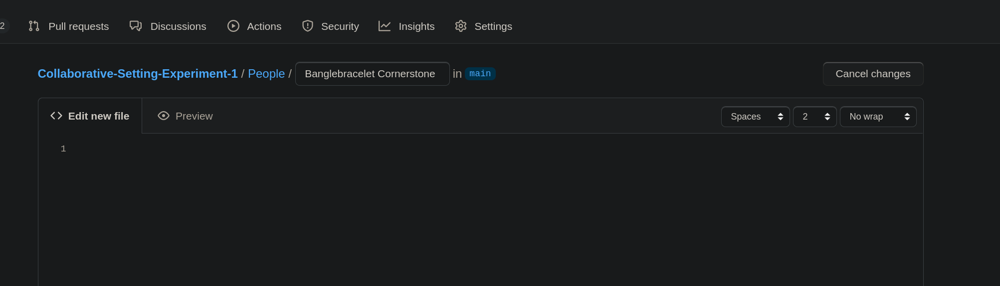
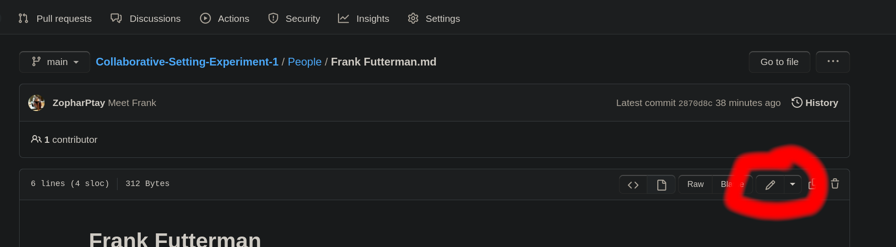

# How to join in

Well, if you are here then you are at least considering making a contribution.  
Anyone who knows how to use GitHub already, you know what's up.  This is just a 
bunch of interlinked markdown files.  Fire away.

### **If the above doesn't tell you anything, then this document is for you!**

## Step One: Create a (free!) GitHub account and log in.  
For the time being, the project is open to the public and will remain so until/unless it gets defaced.
If that happens, it will get locked down and we'll require an invite code.

## Step Two:  Contributing The Easy Way

### You can't break anything here!
One of the best parts about using GitGHub is that everything can be undone.  Don't stress, you can't
destroy or delete anyone else's work onm accident.  The only thing you CAN do wrong is forget to save 
your work.  Everything else can be salvaged, just hit Zoph up or leave a note in the Discussions tab 
(at the top of the screen) and we'll get it fixed.  Relax, grab a drink.  Nothing can be destroyed 
here without actively and maliciously doing so, and you there are enough safeguards that you really 
can't possibly do it without knowing how to.  Honestly.  It's okay.  We got this.  
Experiment, and have fun.

### Add A New Page (for a Person, Place, Thing, or Event)
There is an "Add File" button on the top, next to the big green "Code" button.

Click "Add File" then "Create new file".  That will bring you to the editor page where you 
will see something like this:

At the top where it says "Name your file..." you will do just that.  You need to add your 
folder names in there if they are missing, for example, to add a new Person it might look like 
this:

Remember to end it in `.md` so that we can use [markdown](https://docs.github.com/en/get-started/writing-on-github/getting-started-with-writing-and-formatting-on-github/basic-writing-and-formatting-syntax#styling-text) 
to prettify the page.

Then start typing.  Add ad much or as little as you want.  Eventually we will have templates 
to make it even easier to create new pages, but we're just getting started so for now, do your 
thing.  When you are done, click "Commit changes" at the bottom of the page.  If you don't know 
what those boxes at the bottom mean, then just leave them alone, no biggie!  You don't have
to worry about those fields at all, just click the big green button and leave the rest. 

### Edit An Existing Page
Open up the page you want to edit and click the pencil!  

If you have created a page, then the rest should look familiar.  If not, then see the above section.

### There's a "Blame" button?   That's kinda rude....
Yeah, I didn't name it.   But what it does is kind of neat.  If you open an existing page and click 
it, it will show you who wrote each line of the page.  So if you want to see who added that line about 
the blacksmith's favorite after-work hangout, you can see who suggested it and maybe have a chat to see 
if they mind if you add a page for the new Place, or see if they had something in mind for it already 
that you two can collaborate on.

### How do I know who entered some info?
You want to see who to talk to about something that is on some page?  See the "Blame Button" section 
above.   I didn't name it, I swear.  

## Step Two (Alternative): Contributing The Hard Way

If you have ever done any kind of coding in an IDE then there is a good chance you have used Git before 
in some form or other.  One example would be to set up one of the JetBrains IDEs.  I use PyCharm for 
work so that's what I am using.  If you don't know what any of that means, it's frankly more effort than 
it's worth.  But if you already have that stuff set up, maybe it's worth a look.